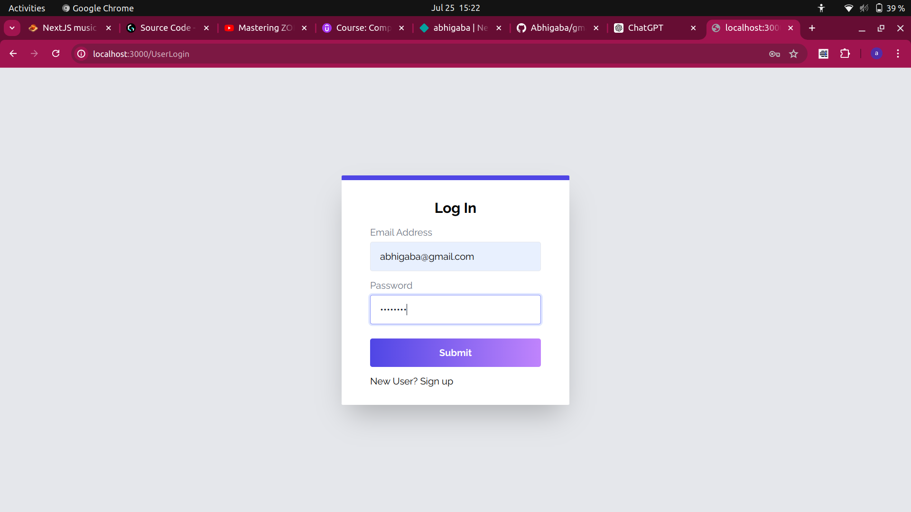
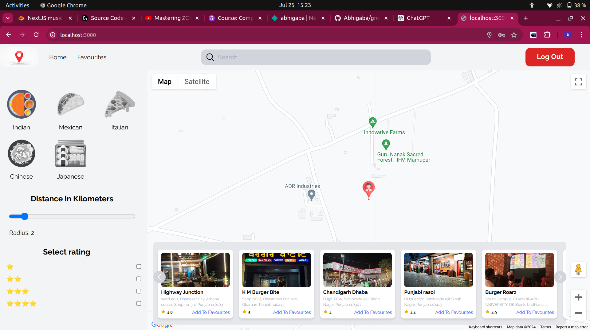

Welcome to the Restaurant Finder project! This application helps users find restaurants based on their location and preferences. Built with Next.js , it utilizes a map interface to provide an interactive, responsive and user-friendly experience.

##  Copy code
``git clone https://github.com/yourusername/restaurant-finder.git
cd restaurant-finder``

## Install dependencies:

``npm install``

## Running the web app
``npm run dev``

## Technologies
**Frontend:** :Next.js, React,Tailwind CSS, Appwrite
**APIs:** : Map API  , Places API

## Output

